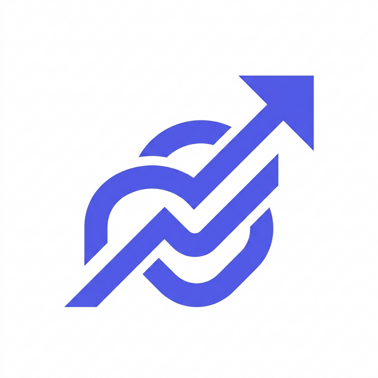

# <div align="center">  <br> EquityFlow </div>

<p align="center">
  <br>
  <strong>A premium, ultra-modern paper trading platform with a minimalist glass-morphism UI.</strong>
  <br>
  <br>
  
  
  
  
  
</p>

## ✨ Overview

EquityFlow is a meticulously designed front-to-back virtual stock trading application. It simulates real-world equity, futures & options (F&O), and commodities markets.

The primary focus of this project is its **industry-tier user interface**. Heavily inspired by Apple Vision Pro and modern fintech platforms (like Linear, Robinhood, and Stripe), EquityFlow features a custom-built "frosted glass" aesthetic, fluid animations, and a strict minimalist design system utilizing the **Plus Jakarta Sans** typeface.

## 🚀 Features

- **Premium Glass-Morphism UI:** Hand-crafted CSS utilities mimicking real frosted glass with strict Apple-inspired depth mapping, subtle glows, and flawless dark/light mode transitions.
- **Real-Time Data Streams:** Custom hooks (`useStreamPrices`, `useAllStreamPrices`) seamlessly update asset prices and flash order book changes in real-time.
- **Comprehensive Portfolio Tracking:** Distinct panels for long-term holdings, intraday positions, and F&O contracts. Tabular numeric data streams seamlessly.
- **Interactive Charting:** Built-in integration with TradingView's `lightweight-charts` for smooth, performant candlestick data.
- **Modern Tech Stack:**
  - Frontend powered completely by Next.js App Router and React Server/Client Components.
  - Sub-millisecond styled with Tailwind CSS, `clsx`, and `tailwind-merge`.
  - Python FastAPI backend acting as a mock exchange/data provider.

## 💻 Tech Stack

### Frontend

- **Framework:** Next.js 14.2
- **Library:** React 18
- **Styling:** Tailwind CSS (Custom Indigo/Glass Theme)
- **Typography:** Plus Jakarta Sans & Inter
- **Icons:** Lucide React
- **UI Primitives:** Radix UI
- **Animations:** Framer Motion
- **Charting:** Lightweight Charts

### Backend

- **Framework:** FastAPI
- **Server:** Uvicorn
- **Language:** Python 3.11+

## 🛠️ Getting Started

### 1. Requirements

- Node.js (v18+)
- Python (3.11+)

### 2. Clone and Install

```bash
# Clone the repository
git clone https://github.com/yourusername/equityflow.git
cd equityflow

# Install frontend dependencies
npm install
```

### 3. Setup Backend

```bash
# Navigate to backend directory
cd backend

# Create virtual environment
python -m venv venv

# Activate venv (Windows)
.\venv\Scripts\activate
# Activate venv (Mac/Linux)
# source venv/bin/activate

# Install requirements
pip install -r requirements.txt
```

### 4. Run the Application

You can use the provided powershell script to boot both simultaneously on Windows:

```powershell
.\start-all.ps1
```

Or run them individually:

**Terminal 1 (Backend):**

```bash
cd backend
python main.py
# Runs on http://127.0.0.1:8001
```

**Terminal 2 (Frontend):**

```bash
npm run dev
# Runs on http://localhost:3000
```

## 🎨 Design System

EquityFlow departs from standard dashboard templates by utilizing a heavily customized `tailwind.config.ts` and `globals.css`:

- **Colors:** Deep Navy (`#0F1117`), Frosted White (`#FAFBFC`), and Indigo Accent (`#6366F1`).
- **Glass Effects:** Custom classes (`.glass`, `.glass-panel`, `.glass-card`) relying on CSS backdrop-filters (`blur(20px) saturate(180%)`) combined with semi-transparent RGBA borders for the "inset" edge lighting effect.
- **Type:** Enforced `<span className="tabular-nums">` for all flashing numeric data to prevent layout jitter.

## 📄 License

This project is licensed under the MIT License - see the LICENSE file for details.
